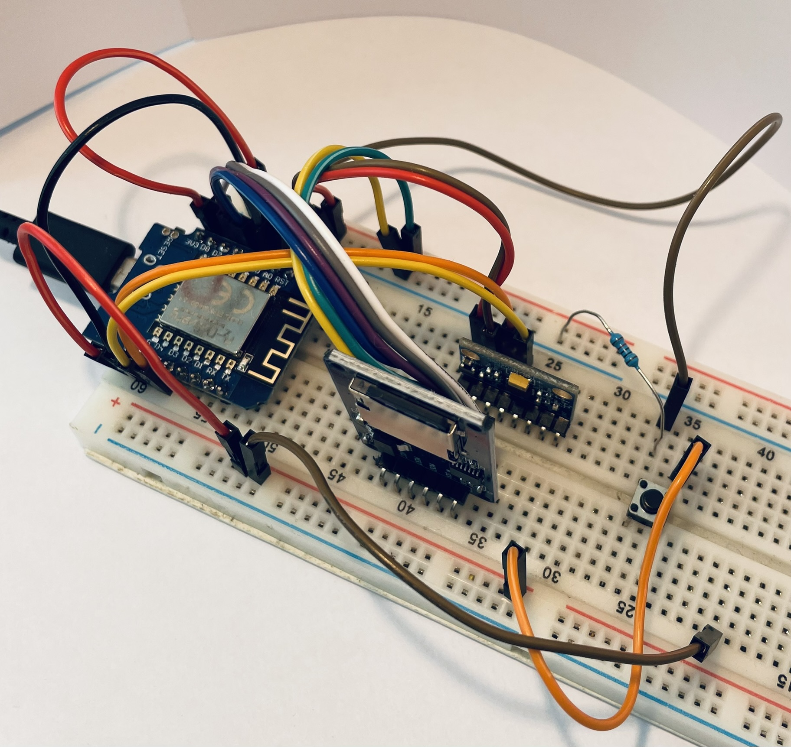
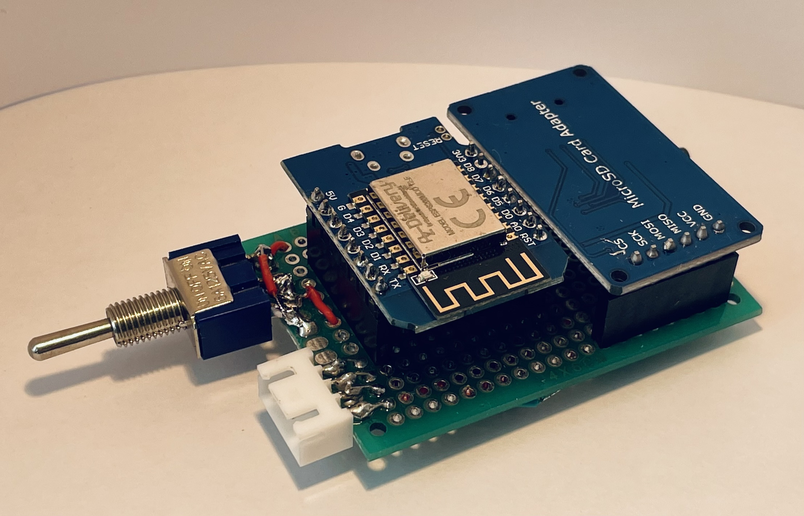
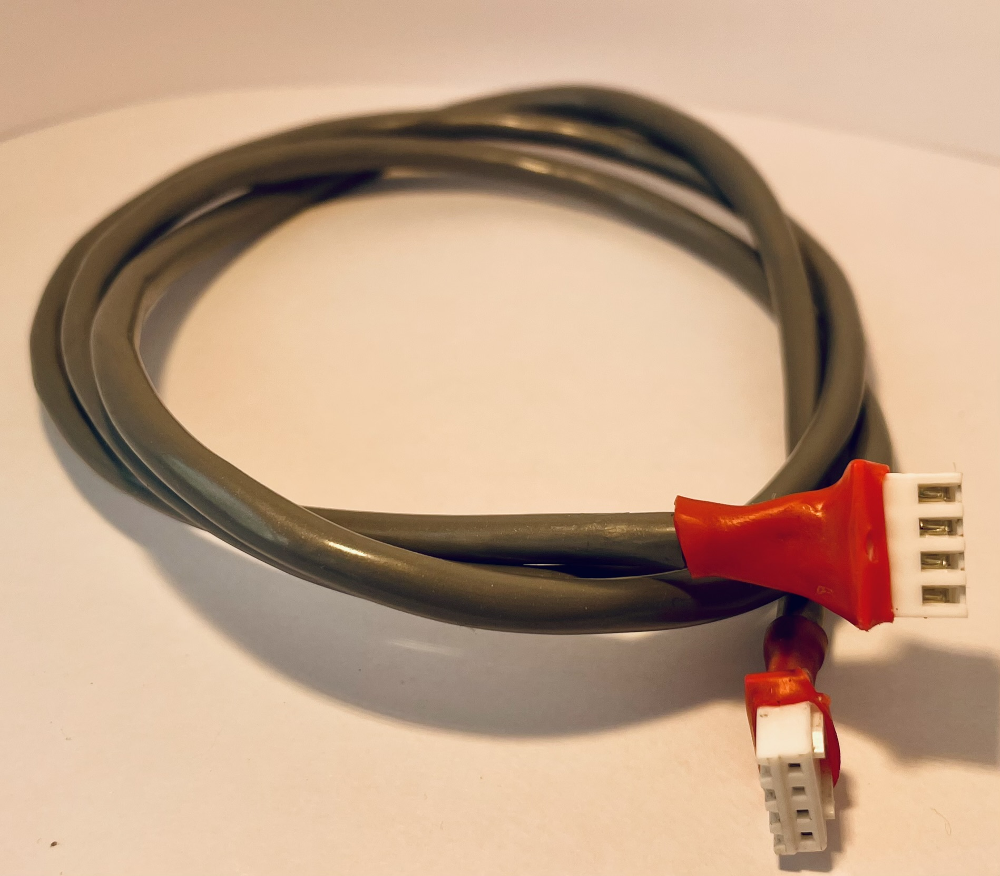
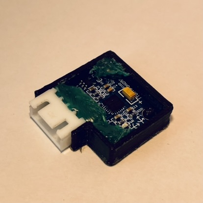

# Racket-Sensor
Projet ingénieur essai- Capteur pour raquette de squash et analyse des données. Améliorez votre jeu avec la data. 🎾📊

Ce repository contient un projet passionnant visant à développer un capteur fixé sur une raquette de squash. L'objectif principal est de monter en compétence dans les essais de produits sportifs en acquérant des connaissances pratiques en capteurs, électronique, microcontrôleurs et traitement de données.

</a>
</a>

## Idée et début : Capteur de Raquette de Squash et Compétences en Essais Sportifs
Ce projet vise à concevoir un capteur intégré à ma raquette de squash pour améliorer mes compétences en essais de produits sportifs. J'acquerrai ainsi des connaissances en capteurs, électronique, microcontrôleurs et traitement des données pour exploiter efficacement les informations recueillies.

- Collecter des données telles que la vitesse, l'angle d'impact et la force de frappe.
- Traiter et analyser les données pour améliorer les compétences en jeu de squash.
- Acquérir des connaissances pratiques en électronique et microcontrôleurs ainsi que d'analyse de données provenant de capteurs.
- Monter en compétence sur la qualitée des données obtenue et précision des dispositifs 

## Contenu du Repository
**/capteur** : Documentation technique sur le capteur, son schéma de montage et son fonctionnement / code.

**/analyse_donnees** : Scripts d'analyse des données.

**/ressources** : Fichiers et ressources utiles pour le projet.

**/images** : images du projet

**/impression_3d** : fichiers 3d, fichier stl pour l'impression 3d ...

## Phase 01 : [Developpement du capteur](capteur/Developpment_capteur.md)
</a>

</a>
</a>
</a>

## Phase 02 : [Premiers traitements des données](analyse_donnees/analyse_traitement_data.md)

## Phase d'essais 01 : en cours ...

